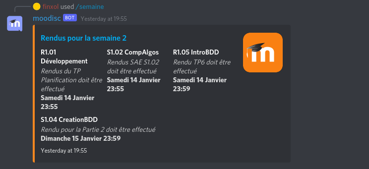

# Moodisc
Discord bot for moodle


## Available commands

- `/help`: See a help page listing all available commands. Dynamically generated.
- `/mois`: See all upcoming events for the next month.
- `/semaine`: See all upcoming events for the next week



## Setup

First, clone this repository, `cd` into it and install dependencies
```bash
git clone https://github.com.finxol/moodisc
cd moodisc
npm install
```
Then get your discord and moodle tokens, and add them to your environnement
```bash
export DISCORD_TOKEN=<your discord token here>
export MOODLE_TOKEN=<your moodle token here>
```

You may also change the url for your moodle website in `getEvents.js`.

After you've added your discord bot to your desired server(s), you can start the bot.
```bash
npm run dev
```

If you want it to run continuously in the background and have [forever](https://www.npmjs.com/package/forever) installed,
you can directly start the forever process with
```bash
npm run start
```
The `restart` and `stop` scripts are also available for easily managing the process.
